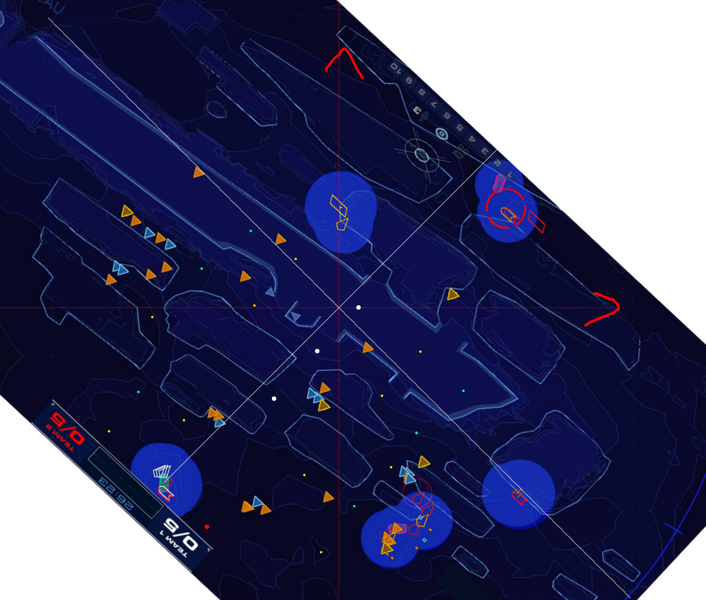
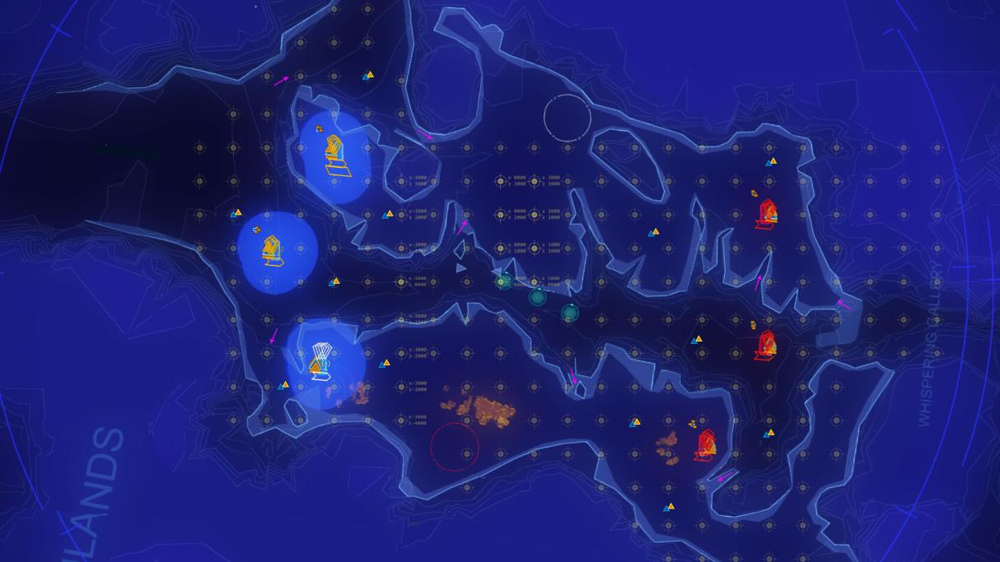

# Deserts of Kharak Mapping Tutorial
In order to create custom maps you need the More Maps mod. Find the install directory of DoK `(Steam Client->Library->Right Click Deserts of Kharak->Properties...->Local Files->Browse Local Files)`. Then goto `Data/Managed/maps` (location for easy manual installation) where you should see a bunch of `.dokmap` files. To create the map mod modify the map file that belongs to the map you want to change. After each change to the file you only need to restart the level, you don't have to restart the whole game.

Map Layout Format
======
The layout of maps are stored in XML, this is the XML for Kalash Wreck with Fathership:
```
<?xml version="1.0" encoding="UTF-8"?>
<dokmap>
	<map>M05</map>
	<mode>Team</mode>
	<!-- the following 4 don't do anything -->
	<name>Kalash Wreck</name>
	<description>Fathership duel map</description>
	<authors>Begil, SSSS</authors>
	<players>2</players>
	
	<heat>10</heat> <!-- optional -->
	<bounds top="10000" right="2000" bottom="0" left="-8000"/> <!-- optional -->
	
	<spawns>
		<!-- team 1 -->
		<spawn team="0" index="0" x="10000" z="10000" angle="0"/>
		<spawn team="0" index="1" x="10000" z="10000" angle="0"/>
		<spawn team="0" index="2" x="10000" z="10000" angle="0"/>
		<!-- team 2 -->
		<spawn team="1" index="0" x="10000" z="10000" angle="120"/>
		<spawn team="1" index="1" x="10000" z="10000" angle="120"/>
		<spawn team="1" index="2" x="10000" z="10000" angle="120"/>
	</spawns>
	
	<resources> 
		<!-- type 0 = cus, type 1 = rus -->
		<!-- team 1 -->
		<resource x="-700" z="4100" type="0" amount="7500" collectors="2"/>
		<resource x="-700" z="4000" type="1" amount="3000" collectors="2"/>
		<resource x="-700" z="3900" type="0" amount="7500" collectors="2"/>

		<resource x="-1000" z="2000" type="0" amount="10500" collectors="2"/>
		<resource x="-1025" z="2100" type="1" amount="4000" collectors="2"/>

		<resource x="-3000" z="2000" type="0" amount="10500" collectors="2"/>
		<resource x="-3025" z="2100" type="1" amount="4000" collectors="2"/>


		<!-- team 2 -->
		<resource x="-6250" z="6975" type="0" amount="7500" collectors="2"/>
		<resource x="-6200" z="6925" type="1" amount="3000" collectors="2"/>
		<resource x="-6150" z="6875" type="0" amount="7500" collectors="2"/>

		<resource x="-4600" z="8700" type="0" amount="10500" collectors="2"/>
		<resource x="-4625" z="8600" type="1" amount="4000" collectors="2"/>

		<resource x="-7000" z="9100" type="0" amount="10500" collectors="2"/>
		<resource x="-7025" z="9000" type="1" amount="4000" collectors="2"/>
	</resources>
	
	<artifacts>
		<artifact x="-4000" z="6000"/>
		<artifact x="-3000" z="5500"/>
		<artifact x="-2000" z="5000"/>
	</artifacts>
	
	<ezs>
		<!-- extraction zones -->
		<!-- Kalash Teeth has extraction zones of radius 500 for reference -->
		<ez team="0" x="-1500" z="6500" radius="500"/>
		<ez team="1" x="-5000" z="4500" radius="500"/>
	</ezs>
  
	<units>
		<unit team="0" index="0" type="G_Fathership" x="-1000" z="4000" angle="0"/>
		<unit team="0" index="0" type="G_SupportCruiser" x="-1000" z="3400" angle="0"/>
		<unit team="0" index="0" type="G_Baserunner" x="-1000" z="3200" angle="0"/>
		<unit team="0" index="0" type="G_Harvester" x="-1150" z="4600" angle="0"/>
		<unit team="0" index="0" type="G_Harvester" x="-1050" z="4600" angle="0"/>
		<unit team="0" index="0" type="G_Harvester" x="-950" z="4600" angle="0"/>
		<unit team="0" index="0" type="G_Harvester" x="-850" z="4600" angle="0"/>

		<unit team="1" index="0" type="G_Fathership" x="-5950" z="7200" angle="128"/>
		<unit team="1" index="0" type="G_SupportCruiser" x="-6422" z="7569" angle="128"/>
		<unit team="1" index="0" type="G_Baserunner" x="-6580" z="7692" angle="128"/>
		<unit team="1" index="0" type="G_Harvester" x="-5417" z="6920" angle="128"/>
		<unit team="1" index="0" type="G_Harvester" x="-5457" z="6860" angle="128"/>
		<unit team="1" index="0" type="G_Harvester" x="-5497" z="6800" angle="128"/>
		<unit team="1" index="0" type="G_Harvester" x="-5537" z="6740" angle="128"/>
	</units>
	
	
	<blockers existing="false">
		<!-- top wreck -->
		<blocker mask="Ground" blocklof="true" verts="-300,140;-300,2150;810,2140;810,140"/>
		<!-- bottom wreck -->
		<blocker mask="Ground" blocklof="true" verts="-300,-270;-300,-1630;810,-810;810,-270"/>
		<!-- block carrier -->
		<blocker mask="Carrier" blocklof="true" verts="-300,-140;-300,140;810,140;810,-140"/>
	</blockers>

</dokmap>
```

| Node Name | Description | Notes |
| --------- | ----------- | ----- |
| name | name of the layout | (does nothing as of now) |
| map | allowed map string IDs | comma separated list of the allowed map IDs, `*` means all maps (see [maps.md](maps.md) for a list of all map names) |
| mode | the gamemode the layout is for | the options are `Team` and `FFA` - the layout won't load for another gamemode |
| description | description of the layout | (does nothing as of now) |
| authors | list of the layout authors | (does nothing as of now) |
| players | max players for this layout | (does nothing as of now, the max is always 6 on all maps) |
| bounds | sets the location for the edges of the map | `top` is the highest z bound - `bottom` is the lowest z bound - `right` is highest x bound - `left` is the lowest x bound |
| spawn | represents a spawn point | `index` is the player index within a team which means the pair (`team`, `index`) must be unique (for FFA index is not needed, give each player its own team) - angle is the angle in degrees (same angles as in sensor manager) |
| resource | represents both CU and RU points | `type` represents CU (=0) or RU (=1) - `amount` is the amount of that resource - `collectors` is the max number of collectors that can mine at once |
| artifact | represents an artifact | you can have as many or few artifacts as you want (not only 3) |
| ez | represents an extraction zone | only 1 per team is possible |
| unit | represents a unit | `team` and `index` should be same as in `<spawn/>` - `type` is the name of the unit to spawn (for FFA index is not needed, just match `team` with the corresponding `team` in `<spawn/>`) - `angle` works the same as in `<spawn/>` (note units will only spawn for a player if the player is in the game - see [units.md](units.md) for a list of all unit names) |
| blocker | represents a blocker | `mask` is a comma separated list of unit classes that can't pass through the blocker (see [masks.md](masks.md) for a list of all unit class names) - `blocklof` is a boolean that changes whether the blocker blocks line of sight - `verts` is a cloud of coordinates that make a *convex* shape |
| blockers | adds extra blocker options | `existing`: false means existing map blockers are removed, true is the default and means they aren't removed - `carrier`: true is the default and has no effect, false means carrier blockers are removed but carries won't path around Ground class blockers (its fine for most maps but using `existing` and `blocker`s instead is the best way except on some maps where it doesn't make a difference) |

`<spawns>`, `<resources>`, `<artifacts>`, `<ezs>`, `<units>` and `<blockers>` are optional. Positive x points towards 90 degrees in sensors while positive z points towards 0 degrees in sensors. `team="0"` is shown as `Team 1` in game while `team="1"` is shown as `Team 2` in game.

Calculating Object Locations
======

The problem now is how do you know what coordinates to give objects? Doing this by trial and error would take far too long. First setup some spawn points like this:

```
<?xml version="1.0" encoding="UTF-8"?>
<dokmap>
	<name>Calibration Map</name>
	<map>*</map>
	<description>Test Map</description>
	<authors>SSSS</authors>
	<players>6</players>
	
	<spawns>
		<!-- team 1 -->
		<spawn team="0" index="0" x="0" z="0" angle="0"/>
		<spawn team="0" index="1" x="0" z="0" angle="0"/>
		<spawn team="0" index="2" x="0" z="0" angle="0"/>
		<!-- team 2 -->
		<spawn team="1" index="0" x="0" z="0" angle="0"/>
		<spawn team="1" index="1" x="0" z="0" angle="0"/>
		<spawn team="1" index="2" x="0" z="0" angle="0"/>
	</spawns>
	
	<resources>
		<resource x="0" z="0" type="0" amount="7500" collectors="2"/>
		<resource x="4000" z="0" type="0" amount="7500" collectors="2"/>
		<resource x="0" z="8000" type="0" amount="7500" collectors="2"/>
		<resource x="4000" z="8000" type="0" amount="7500" collectors="2"/>
	</resources>
</dokmap>
```

Start the map and take a picture looking straight down from as far as possible. This layout will allow you to find the origin, orientation and scale of the map in the image you just took. Its possible that the map isn't centered on (0, 0) and some of these resources may be off the map/non-existent. If that happens just play around with the values until everything is on the map.



Next step is to plan the layout. First draw some axis onto the map to make things easier, then draw the locations you want everything to be in. The above image doesn't use any resources since I used spawn locations instead however resources are the way to go since they don't move.

The final step is to use the image to calculate the coordinates for all the objects. To do this use the measuring tool in an image editing program (you need something a little more advanced than paint.exe, GIMP is free and lets you do this quite easily). The measuring tool will most likely use pixels as distance so you need to change the measuring tool to measure in a different unit and set the unit so that the distances you measure are equal to in-game units. (In GIMP measure the distance from the origin to the `<artifact x="0" z="8000"/>` artifact in pixels. Go to `Image->Print Size...`. Set pixels per inch to be `[number of pixels] / 8000` since 8000 is the distance from the origin to this artifact. Then finally change the unit in the bottom left of the image editor to be inches).

The measuring tool should show the x and y distances as well as the direct distance. Use the x and y distances (x->x, y->z) with the help of the axes if it doesn't show negative distances to work out the coordinates. Measure from the origin of the map (e.i. where the axes cross).


[Different planning option](examples/beladin_sea_raiders.pptx)

These are another way to do things, it can be a quicker way than the above method if you are able to generate such a grid. The PowerPoint shows how to make one.

Community Map Tools
======
| Name | Authors | Description
| ---- | ------- | -----------
| [Layout Trigonometry Calculator](https://docs.google.com/spreadsheets/d/18sfTI52rmCuiPYDxbEvSLlov7KUSy49SlSkl22KOWAc/edit#gid=0) | FrostyTeeth | A spreadsheet to batch calculate rotations around a point across multiple different coordinates
