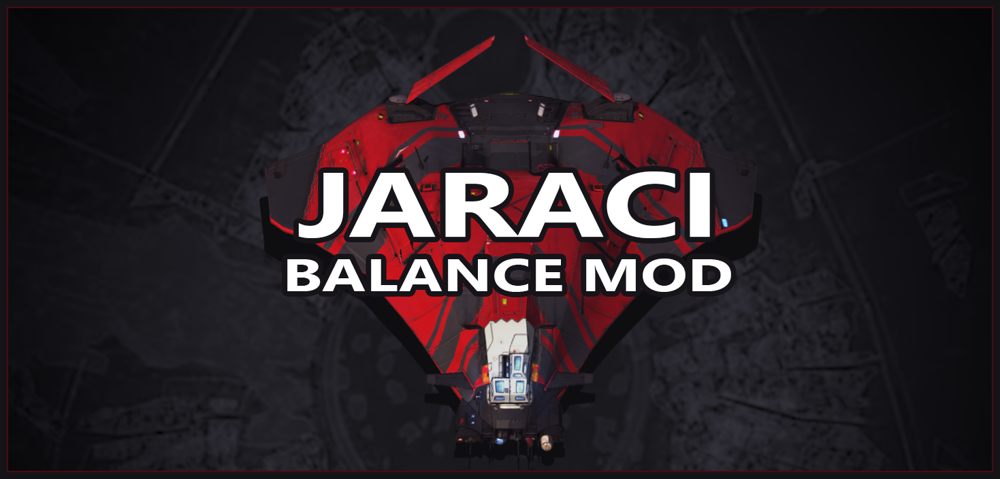

# Introduction

## About

**Jaraci balance mod** is a **Homeworld: Deserts of Kharak** modification created with the help of some of the best competitive Deserts of Kharak players. The mod focuses on improving faction and unit interactions, balance and quality of life throughout the game while retaining most of the intuitive Deserts of Kharak feel.

Casts of **Jaraci Cup** games can be found on [Bozocow's YouTube channel](https://www.youtube.com/user/Bozothcow/videos).

If you are interested in learning about most available unit stats for the mod, check out the [generated unit statistics](https://github.com/AGameAnx/dok-repo/tree/master/info/generated_stats/jaraci) files.

The mod is created using [Subsystem](https://github.com/AGameAnx/Subsystem). It is not recommended to install Subsystem on its own, however. Subsystem comes as part of the Gameplay Extensions mod (see [how to play](#how-to-play)).

Latest tournament source file (you do not have to install this manually): [jaraci.json](https://github.com/AGameAnx/dok-repo/blob/master/patches/jaraci.json)

Special thanks to Majiir and SSSS for paving the way towards a balance mod being possible, to Descara, Just_carrier and Bozocow for being awesome suggestion, support, discussion and playtest help.

## How to play

It is recommended to play Jaraci patch using the [Gameplay Extensions mod](https://github.com/AGameAnx/dok-ge-mod/releases). Gameplay Extensions mod allows players to load custom layouts and attribute patches directly in multiplayer lobbies. It does not affect your ability to play vanilla Deserts of Kharak games. Check out the [install instructions](https://github.com/AGameAnx/dok-ge-mod#installation).

Use the following command in match setup chat to load the mod:

**`/p jaraci`**

Previous tournament mod versions can be found by using commands below, where # is the tournament number.

**`/p jaraci#`** (For example: `/p jaraci17`)

## Changelog

Changelog can be found in a [sister document](jaraci_recent_changes.md).

# Table of contents

- [Introduction](#introduction)
    - [About](#about)
    - [How to play](#how-to-play)
    - [Changelog](#changelog)
- [Table of contents](#table-of-contents)
- [General changes](#general-changes)
    - [Carriers](#carriers)
        - [Power level upgrades](#power-level-upgrades)
        - [Range power systems (Gaalsien/Coalition)](#range-power-systems-gaalsiencoalition)
        - [Point defense weapons](#point-defense-weapons)
        - [Missile systems](#missile-systems)
        - [Indirect fire systems (nukes)](#indirect-fire-systems-nukes)
    - [Sunder](#sunder)
    - [Unit upgrades](#unit-upgrades)
        - [Medium vehicle armor](#medium-vehicle-armor)
        - [Strike craft damage upgrades](#strike-craft-damage-upgrades)
        - [Strike craft armor upgrades](#strike-craft-armor-upgrades)
    - [Quality of life](#quality-of-life)
        - [Fog of war reveal duration after firing](#fog-of-war-reveal-duration-after-firing)
        - [Target prioritization](#target-prioritization)
            - [Railgun target prioritization](#railgun-target-prioritization)
            - [Unit priority as target](#unit-priority-as-target)
        - [Air sorties](#air-sorties)
        - [Units lost tab improvements for replay viewing](#units-lost-tab-improvements-for-replay-viewing)
    - [Generic balance changes](#generic-balance-changes)
        - [Small arms anti-air weapons](#small-arms-anti-air-weapons)
        - [Salvager](#salvager)
        - [Salvager CU mining](#salvager-cu-mining)
        - [Salvager RU hold size](#salvager-ru-hold-size)
        - [Demolition pack](#demolition-pack)
        - [Baserunner](#baserunner)
        - [Artillery barrages (except Khaaneph)](#artillery-barrages-except-khaaneph)
- [Coalition / Soban](#coalition--soban)
    - [Carriers](#carriers-1)
    - [Coalition carrier](#coalition-carrier)
        - [Cruise missile](#cruise-missile)
    - [Soban carrier](#soban-carrier)
    - [Salvager](#salvager-1)
    - [Logistics module](#logistics-module)
        - [ALM](#alm)
        - [Microwave emitter](#microwave-emitter)
    - [Armored vehicle upgrades](#armored-vehicle-upgrades)
    - [Production upgrades](#production-upgrades)
    - [Support cruiser](#support-cruiser)
    - [Baserunner](#baserunner-1)
        - [Probe](#probe)
        - [AA turret](#aa-turret)
        - [Gun turret](#gun-turret)
        - [Targeting jammer](#targeting-jammer)
    - [LAV](#lav)
    - [AAV](#aav)
    - [Railgun](#railgun)
        - [Mag accelerator upgrade](#mag-accelerator-upgrade)
        - [Coalition railgun](#coalition-railgun)
        - [Soban railgun](#soban-railgun)
    - [Missile battery](#missile-battery)
    - [Assault cruiser](#assault-cruiser)
    - [Battlecruiser](#battlecruiser)
        - [Coalition](#coalition)
        - [Soban](#soban)
    - [Artillery cruiser](#artillery-cruiser)
    - [Fighter and gunship fabrication](#fighter-and-gunship-fabrication)
        - [Strike fighter](#strike-fighter)
        - [Gunship](#gunship)
    - [Tactical bomber](#tactical-bomber)
- [Gaalsien / Khaaneph](#gaalsien--khaaneph)
    - [Population capacity upgrades](#population-capacity-upgrades)
    - [Salvager](#salvager-2)
    - [Carrier common](#carrier-common)
    - [Gaalsien carrier](#gaalsien-carrier)
        - [Hyper-sonic missile barrage](#hyper-sonic-missile-barrage)
    - [Khaaneph carrier](#khaaneph-carrier)
    - [Baserunner](#baserunner-2)
        - [Gaalsien baserunner](#gaalsien-baserunner)
        - [Khaaneph baserunner](#khaaneph-baserunner)
            - [Blast drone](#blast-drone)
    - [Sandskimmer](#sandskimmer)
    - [Production cruiser](#production-cruiser)
    - [Assault ship](#assault-ship)
    - [Missile ship](#missile-ship)
    - [Vehicle armor upgrade cost](#vehicle-armor-upgrade-cost)
    - [Railgun fabrication](#railgun-fabrication)
        - [Assault railgun](#assault-railgun)
        - [Heavy railgun](#heavy-railgun)
    - [Railgun armor upgrades cost](#railgun-armor-upgrades-cost)
    - [Interceptor](#interceptor)
    - [Precision bomber](#precision-bomber)
    - [Siege cruiser](#siege-cruiser)
        - [Gaalsien siege cruiser](#gaalsien-siege-cruiser)
        - [Khaaneph siege cruiser](#khaaneph-siege-cruiser)
    - [Honourguard cruiser](#honourguard-cruiser)

# General changes

## Carriers

### Power level upgrades
> *Intention of the cost rebalance is to slightly shift away: `Strike-craft-centric playstyles when using the carrier as well as reduce the incentive to power up the carrier as early as possible.*

* Renamed from `POWER RESERVE #` to `CARRIER SYSTEMS #`
* Updated descriptions to better indicate what the upgrades do, added indication on which upgrade unlocks the nuke
* Speed granted per upgrade: `0 => 1`
* Hitpoints granted per upgrade: `0 => 150`
* Level 1 research time: `20s => 15s`
* Fixed an issue where carriers will lose power from the reserve pool if the available power ever exceeds 30

### Range power systems (Gaalsien/Coalition)
> *All railgun and carrier ranges are reduced in the mod as part of the effort to reduce the prevalence of railgun-based strategies. Carrier ranges are reduced slightly more than railgun ranges.*

* Level 0:
    * Turret max range: `500 => 800`
* Level 1:
    * Turret max range: `500 => 900`
* Level 2:
    * Turret max range: `1100 => 1050`
    * Missile max range bonus: `600 => 550`
* Level 3:
    * Turret max range: `1400 => 1250`
    * Missile max range bonus: `900 => 750`
    * Sight and contact range: `600 => 550`
* Level 4:
    * Turret max range: `1700 => 1450`
    * Missile max range bonus: `1200 => 950`
    * Sight and contact range bonuses: `900 => 800`
* Level 5:
    * Turret max range: `2000 => 1650`
    * Missile max range bonus: `1500 => 1150`
    * Sight and contact range bonuses: `1200 => 1050`

### Point defense weapons
> *These changes should achieve better balance of PD weaponry throughout the game and at all power levels, including better capability to penetrate armored targets.*

* Accuracy profiles:
    * Short: `5% or 100% => 50%`
    * Medium: `4.5% or 90% => 45%`
    * Long: `4% or 80% => 35%`
* Weapon damage: `8 or 10 => 30`
* Benefit from high ground: `Yes => No`
* Penetrating weapon damage: `17 => 75`
* Rate of fire: `See per-carrier changes below`
* Normalized all modifiers against different target sizes:
    * Small: `5 or 8 => 1`
    * Medium: `1, 15 or 18 => 1`
    * Large: `1 or 2000 => 1.3`
    * XLarge, Carrier: `1 or 25 => 1.3`
* Improved visuals of PDs missing their target

### Missile systems
> *Missile systems used to do the majority of carrier's damage, with PD rebalance such design isn't necessary and thus the missile weapon is receiving a reduction in fire rate and damage across all carriers.*

* Damage: `200 => 175`
* Wind-up: `0 => 0.5s`

### Indirect fire systems (nukes)
> *Range change shouldn't affect 1v1 games too much, but will be a pretty big change for team games.*

* Affected by high ground: `Yes => No`
* Range: `35000 to 4500`
* "Incoming missile" indicators:
    * No longer provide sight in the targeted area
    * Fixed an issue where these indicators could get destroyed by area of effect damage
    * Fixed issues where these indicators cost population

## Sunder
> *Giving railguns an even bigger supporting unit role - improving sunder specifically makes small numbers of railguns more effective while not granting larger numbers of railguns more power.*

* Duration: `10s => 20s`
* Armor reduction: `4 => 7`

## Unit upgrades

### Medium vehicle armor
> *Armor upgrades affect some combat situations very drastically, making certain units weaker than intended.*

* Armor granted: `Fixed to +1`

### Strike craft damage upgrades
> *Due to reduced base damage and increased rate of fire these upgrades were too powerful when granting old bonuses.*

* Damage increase per upgrade `2 => 1`
* Cost and research time:
    * Level 1: `400CU 75RU 25s => 150CU 25RU 15s`
    * Level 2: `400CU 150RU 45s => 200CU 75RU 15s`

### Strike craft armor upgrades

* RU cost:
    * Level 1: `75RU => 100RU`
    * Level 2: `150RU => 175RU`
* Hitpoints added per upgrade: `0 => +30`

## Quality of life

### Fog of war reveal duration after firing
> *This is done to make sure slower rate of fire railguns do not cloak in fog of far after firing before firing off the next shot. Previously, soban and coalition railguns would disappear in fog of war between their shots which messes up player micro and makes enemy railguns switch targets. Carriers have the same penalty applied to make it more dangerous to stay on max sensor power shunt and fire at the enemy from a great distance.*

* Railgun and carrier reveal duration after firing: `2.5s => 4.5s`

### Target prioritization

* Increased base target weight target priority for most high damage weapons.
* Target prioritization adjustments for low damage units (AAV, AS, Sandskimmer, LAV).
* Adjusted assault cruiser target prioritization.

#### Railgun target prioritization
> *Railgun target prioritization weights have been reworked to ensure more predictable and smart behavior. Range and angle make less of an impact on railgun target prioritization, but weapon effectiveness is now more important (meaning railguns will prioritize targets that have lower armor but also take high received accuracy from the railguns, which is most likely enemy railguns).*

* Weapon effectiveness weight: `increased`
* Distance weight: `decreased`
* Angle weight: `decreased`
* Auto target sticky bias: `decreased`

#### Unit priority as target
> *Adjusting certain unit priority as targets to make targeting of these units more logical and less micro intensive.*

* Baserunner: `decreased`
* Salvager: `reduced`
* Strike craft: `reduced`
* Blast drone: `increased`
* Logistics module: `reduced`
* Targeting jammer module: `reduced`
* Railgun: `increased`
* Carrier: `increased (inconsistencies fixed)`
* Gun turret: `decreased`
* Missile turret: `decreased`
* Missile ship/missile battery: `reduced`

### Air sorties
> *The optimal way to use air is to always keep them in the air (as there is no fuel system in the game). The micro requirement for keeping air units in the air was to queue as many commands as possible to make the units fly back & forth and not return to carrier. This change should simply lessen the amount of tedious micromanagement required to use air units optimally.*

* Duration: `10s => 40s`

### Units lost tab improvements for replay viewing

* All carriers now have their costs set to `0CU 0RU`
* Turret now affects units lost tab
* AA Turret now affects units lost tab
* Logistics module now affects units lost tab
* ALM now affects units lost tab

## Generic balance changes

### Small arms anti-air weapons
> *LAV are unaffected by this change as they use the same weapon to target air as they do ground.*

* Affected by high ground: `Yes => No`

### Salvager
> *Generally speaking, salvager kills were uncommon and mostly easily replaced as they tended to happen only towards midgame and when some amount of tech is already out on the field. New costs (see faction-specific changes) aim to both make salvager kills more valuable, and expanding slightly more expensive and slow.*

* Population cost: `1 => 2`
* Hitpoints: `900 => 950`

### Salvager CU mining
> *These changes extent CU patch duration by 25% while keeping mining rate virtually the same.*

* Resources collected from patch per cycle: `2 => 4`
* Cycle duration: `0.5s => 1.25s`
* Resource dropped off to collected ratio: `2 => 1.25`

### Salvager RU hold size
> *The combination of RU hold size and mining rate made long-hauling RUs vastly more efficient than long-hauling CUs.

* RU hold size: `40 => 20`

### Demolition pack
> *The goal of these changes is to slow down expansion slightly, to move away some of the cost of expansion from the associated units (PC and SC). The damage is changed to allow demo packs to remain a relevant ability defensively.*

* Cost: `50CU => 100CU`
* Damage: `175 => 200`
* Packets: `1 => 2`

### Baserunner

* Cost: `250CU => 200CU 30RU`
* Max speed: `65 => 70`
* Speed penalty while holding an artifact: `33% => 35%`
* Baserunner priority as target: `reduced`

**Baserunner anti-air**
> *These changes should add some soft early game anti-air to all factions. Surprise air tech can be game ending and blind teching against air used to be almost a necessity for almost all matchups.*

* AA weapon dmg: `5 => 16`
* Packets: `0 => 1`
* Turret rotation speed: `95(180) => 200`
* Damage against probes: `100% => 50%`
* Ranges:
    * Short: `600(300) => 700`
    * Medium: `900(600) => 1280`
* Accuracy:
    * Short: `100%(75%) => 90%`
    * Medium: `100% => 82%`
* Gaalsien BR long range: `Set to unused`
* Removed unused modifiers against ground targets

### Artillery barrages (except Khaaneph)
> *These changes don't apply to Khaaneph Siege Cruiser, although it has seen a different rework (see below). The idea behind these changes is to make immediate impact of artillery barrages lower but allow them to deny an area for longer and have a larger overall impact on the battle. This should allow artillery to better counter railgun high ground positions and better punish less attentive play.*

* Damage against small: `100% => 50%`
* Damage against carriers: `100% => 60%`
* Autofire: `Has same modifiers as main barrage`
* Burst: `1s => 1.7s`
* Cooldown: `0.5s => 1.6s`

# Coalition / Soban

## Carriers

* Movement:
    * Max speed: `60 => 37`
    * Turn radius: `150 => 105`
    * Max ease into turn time: `5s => 0.25s`
    * Acceleration time: `2s => 0.9s`
    * Braking time: `2s => 0.9s`
* Carrier systems upgrades:
    * Cost:
        * Level 1: `140CU 80RU => 150CU 50RU`
        * Level 2: `280CU 160RU => 400CU 175RU`
        * Level 3: `460CU 260RU => 650CU 250RU`
        * Level 4: `720CU 400RU => 900CU 400RU`
        * Level 5: `1100CU 600RU => 1200CU 550RU`
        * Level 6: `1300CU 700RU => 1300CU 700RU`
        * Level 7: `1500CU 800RU => 1400CU 850RU`
    * Renamed to exclude carrier systems 2
    * Level 2 upgrade repurposed:
        * Renamed: `Carrier Mobility`
        * No longer requires power lever 1 to be purchasable
        * Cost: `400CU 175RU => 550CU 250RU`
        * Hitpoints granted: `150 => 0`
        * Extra speed granted: `1 => 13`
        * Grants 2 power as before (can't modify)
    * Level 3 (shows up as level 2):
        * Dependency: `Carrier systems 2 => Carrier systems 1`
        * Cost: `650CU 250RU => 600CU 200RU`
    * NOTE: Cruise missile now available at power level 4 and microwave emitter upgrade at power level 3

## Coalition carrier

**General statistics**

* Hitpoints: `15000 => 8700`
* Carrier power systems level 4 cost: `1200CU 550RU => 1200CU 650RU`

**Point defense weapons**

* Rate of fire: `2 => 4`
* Weapon Systems power shunt PD rate of fire bonuses:
    * Level 1: `'set to 5' => 'increase by 20%'`
    * Level 2: `'set to 10' => 'increase by 35%'`
    * Level 3: `'set to 20' => 'increase by 55%'`
    * Level 4: `'set to 40' => 'increase by 80%'`
    * Level 5: `'set to 40' => 'increase by 25%'`

**Armor system power shunt**
> *Due to railgun damage reductions and other units being less numerous in numbers and generally having lower rate of fire, the insanely high armor of coalition carrier is reduced.*

* Level 0: `25 => 20`
* Level 1: `30 => 25`
* Level 2: `40 => 30`
* Level 3: `75 => 35`
* Level 4: `100 => 50`

### Cruise missile

* Cooldown: `120s => 170s`
* Damage: `5000 => 2300`
* Damage against cruisers and carriers: `100% => 160%`
* AOE: `500 => 550`
* "Incoming missile" indicator delay: `2.75s => 1.5s`

## Soban carrier

**General statistics**

* Hitpoints: `15000 => 8400`
* Base armor: `25 => 15`
* Weapon systems missiles (consistency with other carriers fixes):
    * Damage: `128 => 175`
    * Wind-up: `0 => 0.5s`
    * Range: `500 => 700`

**Armor system power shunt**
> *Soban carrier used to be particularly strong for the carrier rush. It is meant to be a long range support carrier and thus it is getting its armor reduced across all levels of armor power shunt, including the base armor. Despite lowered survivability, it now should be a potent opponent on the battlefield even in lategame.*

* Level 1: `30 => 20`
* Level 2: `40 => 25`
* Level 3: `60 => 30`
* Level 4: `100 => 45`

**Point defense railguns**
> *The new iteration of these railguns works much closer to how Soban railgun units work.*

* Damage: `165 => 180`
* Number of bursts: `10 => 2`
* Burst: `1s => 0.25s`
* Cooldown: `5s => 9s`
* Reload: `10s => 13s`
* Wind-up: `1.6s => 1s`
* Base rate of fire: `6 => 2`
* Range:
    * Medium: `600 => 550`
    * Long: `900 => 1000`
* Accuracy & Modifiers: `set to match soban railguns`
* Target style: `RandomSpray => Flak` (visuals)

**Turret network power shunt**
> *The goal is to make Soban carrier a relatively powerful brawler against armored targets, while keeping its overall damage output at bay and keeping the carrier weak against strike craft.*

* Level 1:
    * Reload: `'Set to 10s => 'decrease by 35%'`
    * Cooldown: `'Set to 5s' => 'decrease by 35%'`
    * Accuracy bonus: `10% => 15%`
* Level 2:
    * Reload: `'Set to 6s => 'decrease by 50%'`
    * Cooldown: `'Set to 3s' => 'decrease by 50%'`
* Level 3:
    * Reload: `'Set to 4s => 'decrease by 65%'`
    * Cooldown: `'Set to 2s' => 'decrease by 65%'`
    * Accuracy bonus: `40% => 35%`
* Level 4:
    * Reload: `'Set to 2s => 'decrease by 75%'`
    * Cooldown: `'Set to 1.5s' => 'decrease by 75%'`
    * Accuracy bonus: `50% => 45%`
* Level 5:
    * Reload: `'Set to 2s => 'decrease by 85%'`
    * Cooldown: `'Set to 1s' => 'decrease by 85%'`
    * Accuracy bonus: `60% => 55%`
* Fixed a number of issues with reload and cooldowns of select PD weapons being updated incorrectly
* No longer setting the damage of the dummy weapon to 160 on every power level

**Range systems power shunt**
> *Soban carrier receives slightly more range than other carriers across all power levels. Due to its guns being placed far away from its center, its PDs can outrange most units in the game at higher power levels.*

* Ranges:
    * Level 1: `800/550/300 => 1150/750/450`
    * Level 2: `1100/750/400 => 1350/1100/700`
    * Level 3: `1400/950/500 => 1500/1300/900`
    * Level 4: `1700/1150/600 => 1650/1400/1100`
    * Level 5: `2000/1350/700 => 1850/1700/1300`
* Fixed an issue where front right turret range wasn't updated correctly at Level 4 power level

**Defensive logistics power shunt**

* Contact radius:
    * Level 1: `1300 => 1100`
    * Level 2: `1400 => 1250`
    * Level 3: `1500 => 1350`
    * Level 4: `1700 => 1450`
    * Level 5: `1900 => 1650`

## Salvager

* Cost: `100CU => 150CU`
* Armor: `5 => 2`

## Logistics module
> *Coalition/Soban logistics modules are generally more popcap efficient per cost than Gaalsien/Khaaneph popcap upgrades, while also being near-instant to produce, therefore they are receiving minor nerfs.*

* Cost: `250CU => 270CU`
* Armor: `5 => 3`
* Coalition logistics module:
    * Hitpoints: `900 => 1100` (matches Soban ALM)
    * Sensors radius: `1200 => 1400`
    * Contact radius: `1225 => 1550`

### ALM
> *It's a bit too difficult to micro around ALMs, they provide too much early game safety and they are too good at locking down expensive cruisers. To offset the reload and area of effect changes ALM damage is upped considerably.*

* Contact radius: `1225 => 1000`
* Damage: `40 => 130`
* Damage packets: `1 => 3`
* Accuracy: `100%/90%/80% => 100%/100%/100%`
* AOE: `100 => 78`
* Target prioritization fixes:
    * Distance weight: `decreased`
    * Angle weight: `decreased`
* World height offset: `0 => 15`
* Stun duration: `1s => 0.85s`

**ALM power shunt**

* Sensors range:
    * Level 1: `1100 => 1000`
    * Level 2: `1300 => 1100`
    * Level 3: `1600 => 1200`
    * Level 4: `1900 => 1300`
    * Level 5: `2200 => 1500`
* Contact radius: 
    * Level 1: `1400 => 1300`
    * Level 2: `1600 => 1400`
    * Level 3: `2100 => 1500`
    * Level 4: `2500 => 1700`
    * Level 5: `3000 => 1900`
* Reload time:
    * Level 1: `4s => 6.5s`
    * Level 2: `3s => 5.5s`
    * Level 3: `2s => 4.5s`
    * Level 4: `1s => 3.5s`
    * Level 5: `0.4s => 2.5s`
* Deployment range bonus:
    * Level 2: `1000 => 800`
    * Level 3: `1500 => 1000`
    * Level 4: `1800 => 1200`
    * Level 5: `2000 => 1500`
* Damage bonus:
    * Level 4: `10 => 30`
    * Level 5: `20 => 50`

### Microwave emitter

* Cooldown: `90s => 150s`
* Cost: `500CU => 400CU`
* Impact damage falloff: `Linear => Quadratic`
* Duration: `20s => 30s`
* Damage packets: `1 => 0`
* Base damage per tick: `170 => 100`
* Burst: `1s => 0.25s`
* Damage against strike craft and salvagers: `100% => 50%`
* Damage against Carrier, XLarge and Large class targets: `100% => 120%`
* Removed the 500 damage per second status affect on friendly units
* Target icon display duration: `20s => 39s`
* "Incoming missile" indicator delay: `0.1s => 1.5s`

## Armored vehicle upgrades
> *Reducing strength of level 3 armor upgrade to both make railguns more susceptible to their counters throughout the game and to lower the power of AAV snowballing.*

* Vehicle armor upgrade level 3 hitpoints granted: `200 => 100`

## Production upgrades
> *It has become quite commonplace to get railgun or AAV tech just to get the last level of production for C/S factions. Requirement changes will open up C/S options significantly, it will allow for more optimized and committed midgame pushes and deadlier timings. Nevertheless, extra cost and other changes will make these pushes require well designed build orders to pull off properly.*

* Requirements: `Railgun/AAV techs => None`
* Level 1 upgrade cost: `500CU => 500CU 50RU`
* Level 2 upgrade cost: `500CU => 600CU 80RU`
* Research time: => `30s => 60s`

## Support cruiser

**General stats**

* Cost: `600CU => 480CU 50RU`
* Production time: `45s => 40s`
* Hitpoints: `4100 => 2900`
* Armor: `3 => 5`
* Turn radius: `100 => 75`
* Population: `6 => 5`
* Armor: `2 => 4`
* Repair rate: `10 => 6`
* Movement dynamics:
    * Acceleration time: `1.5s => 0.9s`
    * Max ease into turn time: `0.8s => 0.25s`
    * Max ease into turn time: `3s => 0.8s`
* PD weapon:
    * Damage: `3 => 16`
    * Rate of fire: `12 => 6`
    * Burst: `0.4-0.8s => 0.8-0.83s`
    * Cooldown: `2s => 0.5s`
    * Reload: `4s => 2s`
    * Accuracy: `75%/55%/35% => 45%/35%/35%`
    * Ranges: `300/600/900 => 400/600/950`
    * Can target air: `No => Yes`
    * Damage against probes: `100% => 20%`
    * Accuracy against non-small targets: `100% => 150%`
    * Benefits from high ground: `Yes => No`
    * Tracer speed: `1000 => 1300` (visuals)
    * Turret:
        * Field of fire: `8 => 360`
        * Field of view: `140 => 360`
        * Rotation speed: `75 => 160`
* Introduced soban-specific appearance

**Anti-air**
> *Support cruiser AA was the strongest AA in the game by a large margin due to simplicity of use, already needing many support cruisers, very large AOE, competitive cost. Ground to ground weapon is now redesigned to have AA and meaningful anti-ground capabilities. This makes defending against early game rushes slightly more easier and allows other aspects of the unit to become weaker (hitpoints, repair rate).*

* Upgrade cost: `500CU 320RU => 450CU 250RU`
* Weapon:
    * Damage: `250 => 70`
    * AOE: `40 => 60`
    * Rate of fire: `2 => 1`
    * Burst count: `1 => 4`
    * Burst duration: `1s => 0.3s`
    * Reload: `4s => 5s`
    * Cooldown: `0.7s => 0s`
    * Wind-up: `0ms => 50ms`
    * Range: `1550 => 1200`

## Baserunner

**General**

* Coalition baserunner hitpoints: `3350 => 1700`
* Soban baserunner hitpoints: `3350 => 1500`

### Probe
> *Probe is slightly too fragile and it often feels random whether it dies or not when it flies into any kind of early game anti-air even if pulled back instantly. The probe is rebalanced along with production cruiser AA, LAV AA and baserunner AA to be more consistent in its interactions with them.*

* Cost: `100CU => 150CU`
* Hitpoints: `100 => 120`
* Sensors radius: `1000 => 1250`
* Contact radius: `1100 => 1550`
* Max movement speed: `250 => 200`
* Max ease into turn time: `1s => 0.6s`

### AA turret
> *Generally, using this turret is quite undesirable and almost never worth the original cost investment. With the cost reduction, hitpoints are also reduced to allow soft countering with air despite the new aerial unit payloads and other changes.*

* Anti-air turret post cost: `350CU => 300CU`
* Hitpoints: `1100 => 900`
* Affected by high ground: `Yes => No`
* Soban initial construction cooldown: `110s => 60s`

### Gun turret
> *Turrets become slightly less self-sufficient and spammable. Hitpoints is a change to prevent blast drones from 1-shotting the turret.*

* Cost: `250CU => 300CU`
* Cooldown: `60s => 120s`
* Vision range: `1200 => 1000`
* Hitpoints: `600 => 850`
* Armor: `5 => 1`

**Gun turret weapon**
> *The goal of this rework is to make baserunner turret slightly more effective against armored targets and to also fix some issues with its performance such as it firing behind dunes. This new iteration of the turret will allow for greater micro potential against it with strike craft and it'll be slightly better at countering highly upgraded tanks. With accuracy always being 100% the turret will always 1-shot skimmers which aren't upgraded with level 2 armor or aren't pulled away.*

* Damage: `30 => 57`
* Damage packets: `1 => 2`
* AOE: `0 => 80`
* AOE falloff: `None => Quadratic`
* Rate of fire: `14 => 4`
* Number of bursts: `2 => 16`
* Cooldown: `0.1s => 0`
* Burst: `0.8-1s => 0.32s`
* Wind-down: `0.25s => 0.05s`
* Reload: `2s => 1.4s`
* Range: `1200 => 1450`
* Accuracy: `95%/85%/75% => 100%/95%/60%`
* Turret rotation speed: `180 => 150`
* World height offset: `5 => 15`

### Targeting jammer
> *Extremely situational ability which wasn't very useful even when used in its perfect case scenarios. Should now be a very competitive ability useful through most stages of the game.*

* Cost: `150CU => Free`
* Hitpoints: `500 => 600`
* Armor: `0 => 2`
* Sensors radius: `0 => 270`
* Contact radius: `0 => 400`
* Cooldown: `60s => 80s`
* Population cost: `1 => 0`
* Projectile: `Mine => Scanner` (increased travel speed)
* Fixed an issue of this unit always being "contacted"
* Implemented deployment radius preview and better range visualization
* Status effect:
    * Max speed reduction: `10% => 35%`
    * Turn radius decrease: `5% => 35%`
    * Acceleration increase: `0 => 25%`
    * Added a unit behavior modifier which makes units try to keep a distance of 400 units away from their target while inside ECM field (this is to prevent AI from endlessly circling the ECM with strike craft)

## LAV

* Tech cost: `300CU => 350CU`
* Tech research time: `35s => 37s`
* Build time: `8s => 12s`
* Hitpoints: `500 => 470`
* Armor: `0 => 2`
* Weapon:
    * Base damage: `15 => 14`
    * Burst: `0.8-1.2s => 0.95-0.105s`
    * Burst count: `4 => 2`
    * Cooldown: `0.8s => 0.4s`
    * Accuracy: `94%/82%/56% => 87%/81%/52%`
    * Max range: `900 => 870`
    * Turret rotation speed: `180 => 390`
    * Damage against air: `100% => 80%`
    * Damage against probes: `100% => 60%`
    * Accuracy modifier against medium: `100% => 115%`
    * Accuracy against large, xlarge: `100% => 130%`
* Max speed: `110 => 120`
* Turn radius: `65 => 60`
* Braking time: `0.75s => 0.7s`
* Acceleration time: `0.75s => 0.7s`
* Speed boost ability:
    * Research cost: `200CU 125RU => 200CU 100RU`
    * Cooldown: `30s => 45s`
    * Speed bonus: `60% => 45%`
    * Turn radius increase: `50% => 35%`
* Armor upgrades CU cost: `200 => 300`
* Upgrade research time:
    * Speed boost: `50s => 40s`
    * Damage level 1: `30s => 25s`
    * Damage level 2: `60s => 45s`

## AAV

**Survivability**
> *The hitpoints are reduced on AAV to make soft-countering them with units such as assault ships or interceptors more of an option than it previously was. Previously, one of the best uses of AAV was to avoid combat, drive past quite a lot of enemy defense to trade and target the squishier targets such as enemy salvagers. This is still possible, but the enemy can react to it a lot easier.*

* Hitpoints: `1400 => 970`
* Sensors: `1000 => 1100`
* Armor: `9 => 7`
* Turret rotation: `120 => 190`
* Smoke cooldown: `90s => 80s`
* Max speed: `80 => 83`

**Pricing**
> *AAV timing on small maps is too oppressive. Due to an increase of unit's lategame utility, the base cost is going up slightly. AAV are not very effective lategame units and are cheap, their population cost didn't reflect this.*

* Tech cost: `350CU 85RU => 280CU 20RU`
* Tech research time: `50s => 65s`
* Cost: `180CU 30RU => 270CU 20RU`
* Production time: `14s => 17s`
* Population: `3 => 2`

**Weapon**
> *AAV weapon has notoriously one of the weakest lategame weapons present in the game (for example, it dealt only 1 damage per shot to upgraded railguns). These changes will allow it to maintain some damage output against units with upgrades.*

* Damage: `11 => 17`
* Rate of fire: `20 => 12`
* Burst: `0.5-0.6s => 0.49-0.54s`
* Cooldown: `0.5s => 0.45s`
* Reload: `1s => 1.6s`
* Accuracy: `85%/75%/65% => 80%/70%/61%`
* AOE radius: `0 => 45`
* AOE falloff type: `None => Linear`
* Range: `800 => 975`
* Slow effect: `50% => 33%`
* Slow duration: `2s => 2.65s`

## Railgun

**General**

* Research cost: `450CU 135RU => 200CU 100RU`
* Research time: `50s => 45s`
* Build time: `14s => 16s`
* Max speed: `60 => 75`

**Accuracy**
> *All railguns have seen a general accuracy increase to reduce RNG of missing in railgun fights. Railguns are now also capable to hit all targets (including LAV/Sandskimmer) relatively consistently instead of having only a very small chance to do so before.*

* Short: `5.6% => 40%`
* Medium: `5.3% => 100%`
* Long: `5% => 65%`

**Damage vs small**
> *Due to railguns having a drastic increase in accuracy against small targets, a new damage modifier has been introduced to properly keep railguns at a disadvantage to these types of units.*
* Damage vs small: `100% => 35%`

**Range**
> *All railgun and carrier ranges are reduced in the mod as part of the effort to reduce the prevalence of railgun-based strategies.*

* Range: `2100 => 1900`
* Aggro range: `2050 => 1900`
* Max desired combat range: `2050 => 1830`

### Mag accelerator upgrade
> *This upgrade was too impactful for early game performance. Railguns are still balanced around this upgrade being present, but the lack of this upgrade in the early game is now not as impactful as before and its cost makes it a more complicated decision as to when to purchase it.*

* Cost: `400CU 100RU => 150CU 250RU`
* Damage bonus: `60 => 20`

### Coalition railgun

* Cost: `200CU 60RU => 300CU 80RU`
* Production time: `16s => 22s`
* Hitpoints: `670 => 820`
* Armor: `3 => 1`
* Experience value: `350 => 450`
* Damage: `225 => 180`
* Wind-up: `1.6s => 1.2s`
* Reload: `3.5s => 1.8s`
* Accuracy vs small: `200% => 100%`
* Accuracy vs ground small support: `200% => 100%`

### Soban railgun

* Cost: `210CU 60RU => 320CU 80RU`
* Production time: `16s => 22s`
* Hitpoints: `680 => 750`
* Armor: `4 => 1`
* Experience value: `350 => 470`
* Damage: `165 => 180`
* Wind-up: `1.6s => 1.2s`
* Cooldown: `2s => 1.5s`
* Reload: `2.5s => 4.55s`
* Accuracy vs small: `500% => 100%`

## Missile battery

**General stats**

* Tech research time: `40s => 30s`
* Cost: `350CU 80RU => 300CU 75RU`
* Hitpoints: `1800 => 1400`
* Production time: `21s => 20s`
* Speed: `50 => 60`
* Armor: `5 => 3`
* Sensors radius: `1400 => 1600`
* Contact radius: `1600 => 1800`
* Reload: `2s => 2.3s`

**Mortar ability**
> *Mortar damage was extremely polarizing. When hitting enemy units from the high ground it had the potential to make game-winning plays of wiping entire enemy strike craft forces, but when hitting normally the damage could end up irrelevant. These changes should make this ability much more consistent in its performance, killing off strike craft in the center, and damaging a good chunk around them in a healthy area of effect.*

* Benefits from high ground: `Yes => No`
* Falloff: `None => Linear`
* Damage packets: `20 => 30`
* AOE: `180 => 220`
* Damage: `450 => 660`

## Assault cruiser

**General stats**
> *Assault cruiser becomes slightly worse at brawling against other cruisers and armored vehicles but gets help in other areas such as its cost, its hitpoints and its abilities. Weapon and armor changes will allow mid-tier units to soft-counter out of position assault cruisers in some fringe situations, whereas previously assault cruisers were very hard to weed out even by much superior numbers when they were positioned behind dunes.*

* Tech research cost: `600CU 350RU => 450CU 200RU`
* Cost: `500CU 250RU => 550CU 240RU`
* Production time: `65s => 57s`
* Hitpoints: `2700 => 2800`
* Armor: `15 => 12`
* Max movement speed: `70 => 65`
* Missile barrage benefits high ground: `Yes => No`
* Cooldowns:
    * Missile barrage: `60s => 40s`
    * Overdrive: `80s => 40s`
    * Self repair: `50s => 40s`
* Overdrive armor bonus: `100% => 50%`
* Tactical missile barrage reworked:
    * Cost: `250CU => Free`
    * Damage: `200 => 160`
    * AOE: `120 => 160`
    * Falloff: `None => Quadratic`
    * Range: `1350 => 1000`
    * Damage against small targets: `100% => 60%`
* Weapon:
    * Damage: `70 => 55`
    * Rate of fire: `2 => 3`
    * Number of bursts: `2 => 3`
    * Reload: `2s => 3.8s`
    * AOE: `80 => 79`
    * Wind-up: `50ms => 0.25s`
    * Burst: `1s => 0.7s`
* Introduced soban-specific appearance

**AA upgrade**
> *This upgrade is very weak, especially because the AA weapon is weaker than normal AA. Cost reduction should make it more desirable.*

* Cost: `500CU 340RU => 300CU 150RU`
* Research time: `65s => 45s`

## Battlecruiser

**Common**
> *The unit is overall unreasonably expensive for utility and options that it provides for the player. Area of effect changes allow battlecruisers to deal somewhat meaningful damage against strike craft forces. Unit is receiving large tech and production cost reductions but reduced survivability. Field repairs should help with battlecruiser self-sustain, fixing issues where each battlecruiser required one or multiple support cruiser maintenance (which often resulted in all battlecruisers being stacked in one spot). These units will exert an extremely powerful presence at the point of battle where they're present, but their prohibitive cost and slow movement speed will mean they will be quite susceptible to being outmaneuvered.*

* Tech cost: `700CU 450RU => 500CU 250RU`
* Research time: `110s => 100s`
* Production time: `75s => 65s`
* Population cost: `6 => 7`
* Self-Smoke ability:
    * Renamed to: `Field Repairs`
    * Recharge: `50s => 65s`
    * Now immobilizes the unit while active
    * Now heals the unit while active:
        * Tick period: `0.2s`
        * Heal amount per tick: `30`
        * Duration: `10s`
        * Total heal amount: `750`

### Coalition
> *Damage is reduced in favor of higher rate of fire. This helps the unit deal with medium vehicles easier while also curbing its insane damage potential against carriers.*

* Cost: `800CU 225RU => 850CU 350RU`
* Population: `6 => 9`
* Hitpoints: `6500 => 3800`
* Armor `25 => 20`
* Damage: `300 => 160`
* Reload : `7s => 3.8s`
* Range : `1250 => 1150`
* Falloff: `Linear => Quadratic`
* AOE: `50 => 60`
* Movement dynamics:
    * Max speed: `50 => 59`
    * Turn radius: `200 => 100`
    * Acceleration time: `1.5s => 0.9s`
    * Braking time: `1s => 0.9s`
* Max desired combat range: `1200 => 1110`
* Turret (Fixes behavior on the move and against fast moving units. New values match Soban):
    * Rotation rate: `80 => 180`
    * Field of fire: `2 => 10`

### Soban

* Cost: `780CU 220RU => 850CU 350RU`
* Population: `5 => 9`
* Hitpoints: `6500 => 3800`
* Armor `25 => 19`
* Movement dynamics:
    * Max movement speed: `50 => 59`
    * Max speed turn radius: `200 => 100`
    * Acceleration time: `1.5s => 0.9s`
    * Braking time: `1s => 0.9s`
* Range: `1750 => 1630`
* Damage: `320 => 300`
* Reload: `5s => 6.3s`
* Cooldown: `3s => 1.2s`
* Wind-up: `0.6s => 1.6s`
* Accuracy:
    * Short: `4% => 40%`
    * Medium: `4% => 100%`
    * Long: `5% => 65%`
* Accuracy modifier against strike craft: `500% => 100%`
* Damage modifier against strike craft: `100% => 50%`
* Max desired combat range: `1200 => 1580` (fixes incorrect attack order behavior)
* Adjusted target prioritization

## Artillery cruiser

**General stats**
> *Getting to artillery should now be much faster and easier. This is designed this way to allow for players to play against enemy railguns without the need of using own railguns, albeit in a still risky way, especially against midgame railgun pushes. Survivability changed to make artillery battles resolve themselves much faster. This makes countering artillery with own artillery less desirable as it's more risky. Additionally, sniping artillery cruisers was too difficult overall.*

* Tech requirement: `Assault cruiser research => AAV research`
* Tech research cost: `500CU 350RU => 500CU 250RU`
* Research time: `100s => 65s`
* Cost: `450CU 250RU => 550CU 160RU`
* Population: `6 => 5`
* Construction time: `70s => 60s`
* Hitpoints: `2500 => 1600`
* Armor: `5 => 2`
* Movement dynamics characteristics:
    * Max speed: `50 => 56`
    * Acceleration time: `1.5s => 1.2s`
    * Braking time: `1s => 0.9s`
    * Turn radius: `100 => 90`
* Active combat approach mode: `Snipe => Hold` (QOL, allows choosing autofire targets and using a-move without closing in)
* Max desired combat range: `750 => 2300` (QOL)

**Autofire**
> *Autofire is an extremely unsatisfying mechanic, exceptionally annoying to deal with for an opposing player while requiring little-to-no effort on the part of artillery cruiser users to be effective. It'll remain useful for forcing enemy to constantly micro their units and force the opponent to displace if they are in range, but will ultimately be less punishing and easier to deal with.*

* Damage: `200 => 80`
* Packets: `2 => 1`
* Reload: `6.5s => 7.5s`

**Barrages**
> *Barrages were pretty difficult to use on most maps against railguns, increased range should help with artillery cruiser usability on a larger variety of maps.*

* Damage: `200 => 220`
* AOE: `100 => 98`
* Barrage recharge: `65s => 70s`
* Rate of fire: `4 => 3`
* Number of bursts: `8 => 6`
* Barrage and precision barrage ranges: `2400 => 2750`
* Precision barrage:
    * Damage: `200 => 180`
    * Benefits from high ground: `Yes => No`
    * Recharge: `30s => 70s`
    * Now has the same modifiers as normal barrage

## Fighter and gunship fabrication

**Tech**

* Research time: `70s => 65s`

### Strike fighter
> *Strike Fighter timings are extremely powerful and their numbers can grow very fast. These changes aim to reduce strike fighter timing attack strength (especially in CvC matchups, but also against gaalsien railgun openings), and make soft countering strike fighters easier (hitpoint reduction).*

* Cost: `150CU 100RU => 270CU 75RU`
* Production time: `15s => 26s`
* Hitpoints: `650 => 490`
* Armor: `2 => 0`
* Sensors radius: `2000 => 2200`
* Contact radius: `2100 => 2400`
* Weapon:
    * Rocket count: `10 => 6`
    * Damage: `120 => 110`
    * Damage packets: `1 => 2`
    * Rate of fire: `2 => 3`
    * Burst: `1000ms => 667ms`
    * Reload: `3000ms => 3332ms`
    * Field of fire: `50 => 55`
* Max hangar size: `15 => 12`

### Gunship
> *Increased range to make weapon work more consistently as the gunship circles its target. Unit cost rebalanced to be more of a CU sink than an RU one. Armor decreased to make PC, BR and LAV be slightly more effective at chipping away at it, but total hitpoint pool increased. Weapon packet count reduced, making it significantly more effective against lightly armored targets. Area of effect is increased but added falloff should make gunship's area damage slightly less powerful overall.*

* Cost: `380CU 250RU => 400CU 120RU`
* Production time: `55s => 35s`
* Population: `2 => 4`
* Hitpoints: `1050 => 1250`
* Armor: `10 => 8`
* Damage: `60 => 50`
* Damage packets: `4 => 1`
* AOE: `150 => 130`
* Falloff: `None => Quadratic`
* Range: `700 => 1050`

## Tactical bomber
> *Costed extremely prohibitively for what it's capable of accomplishing in vanilla. The rebalanced version of the unit should be very useful at destroying clumped up mid tier army units.*

* Research time: `75s => 55s`
* Research cost: `550CU 200RU => 500CU 150RU`
* Cost: `500CU 250RU => 450CU 160RU`
* Production time: `26s => 37s`
* Population: `2 to 4`
* Hitpoints: `1050 => 1250`
* Armor: `15 => 6`
* Max speed: `370 => 390`
* Turn radius: `350 => 250`
* Damage: `2500 => 1600`
* Damage against Small: `100% => 60%`
* AOE: `180 => 190`
* AOE falloff: `Quadratic => Linear`
* Wind-up: `50ms => 0ms`

# Gaalsien / Khaaneph

## Population capacity upgrades

* Cost:
    * Level 1: `250CU => 150CU`
    * Level 2: `310CU => 250CU`
    * Level 3: `390CU => 350CU`
    * Level 4: `490CU => 500CU`
    * Level 5: `610CU => 700CU`
* Research time:
    * Level 1 : `10s => 5s`
    * Level 2 : `10s => 7s`

## Salvager

* Cost: `100CU => 170CU`
* Armor: `2 => 4`

## Carrier common

* Power systems cost:
    * Level 1: `140CU 80RU => 150CU 50RU`
    * Level 2: `280CU 160RU => 300CU 150RU`
    * Level 3: `460CU 260RU => 650CU 250RU`
    * Level 4: `720CU 400RU => 900CU 400RU`
    * Level 5: `1100CU 600RU => 1200CU 650RU`
    * Level 6: `1300CU 700RU => 1300CU 700RU`
    * Level 7: `1500CU 800RU => 1400CU 850RU`

## Gaalsien carrier

**General stats**

* Hitpoints: `12500 => 8300`
* Armor: `40 => 20`
* Interceptor undock animation seconds: `3s => 2.66s`
* Bomber undock total seconds: `8s => 5s` (matches Khaaneph)

**Point defense weapons**

* Rate of fire: `10 => 5`
* Weapon Systems power shunt PD rate of fire:
    * Level 1: `'set to 17' => 'increase by 20%'`
    * Level 2: `'set to 24' => 'increase by 35%'`
    * Level 3: `'set to 31' => 'increase by 50%'`
    * Level 4: `'set to 38' => 'increase by 70%'`
    * Level 5: `Bonus removed (30 => 10)`

**Re-establish systems regeneration rate**
> *With railguns costing more and carrier hitpoints reduced, time to heal the carrier to full was too short.*

* Level 2: `50 => 40`
* Level 3: `70 => 50`
* Level 4: `90 => 65`
* Level 5: `110 => 80`

**Speed**
> *Slight reduction in power of this power system. Chasing down a lategame gaalsien carrier was previously extremely difficult.*

* Base: `10 => 35`
* Speed systems power shunt:
    * Level 1: `+25 => +10`
    * Level 2: `+45 => +25`
    * Level 3: `+65 => +40`
    * Level 4: `+85 => +55`
    * Level 4: `+110 => +70`

### Hyper-sonic missile barrage
> *Nuke-style abilities have the potential to wipe big parts of enemy army without much chance for retaliation, only preemptive preparation is effective. A bigger window is required after their use so that players can have an engagement which will not involve another one. Hyper-sonic missile barrage is also one of the most inconsistent abilities, albeit extremely damaging when hitting larger targets. Damage reduced and increased area of effect should make the ability feel more consistent.*

* Cooldown: `90s => 160s`
* Damage: `600 => 260`
* Damage against carriers: `50% => 100%`
* AOE: `200 => 245`
* AOE falloff: `Linear => Quadratic`
* Missile count per weapon: `10 => 8`
* Fixed an issue where the entity which granted vision for the barrage had a population cost (`1 => 0`)

## Khaaneph carrier

**General stats**
> *Khaaneph armor was abnormally low compared to other carrier which, combined with its slow speed, was a bit too punishable in some situations. The new mobility support makes this carrier considerably faster, adds sensors range and speed.*

* Hitpoints: `12500 => 9100`
* Armor: `20 => 18`
* Sensor radius: `800 => 1200`
* Contact radius: `1000 => 1350`
* Max speed: `40 => 38`
* Power level change time: `5s => 3s` (Now matches other carriers)
* Interceptor undock animation seconds: `2.67s => 2.66s`
* Bomber undock animation seconds: `3.33s => 2.75s` (matches Gaalsien)

**Cruise missiles systems**
> *Khaaneph cruise missiles have proven themselves to be extremely powerful overall and especially against enemy carriers.*

* Damage: `400 => 700`
* Packets: `1 => 5`
* Damage against carriers: `150% => 70%`
* Affected by high ground: `Yes => No`
* Base missile warmup time: `6s => 9s`
* Reload time:
    * Level 2: `9s => 6s`
    * Level 3: `8s => 5s`
    * Level 4: `7s => 4s`
    * Level 5: `6s => 3s`
* Range bonuses:
    * Level 2: `0 => 100`
    * Level 3: `0 => 200`
    * Level 4: `0 => 350`
    * Level 5: `36% => 500`
* Warmup time bonuses:
    * Level 2: `1 => 0`
    * Level 3: `2 => 1`
    * Level 4: `3 => 2`
    * Level 5: `4 => 3`

**Weapon systems**
> *Khaaneph carrier does not have range systems on it, meaning the range of its basic weaponry can never be increased. This meant that weapons systems power shunt was mostly useless as it could never get range on the opponent. Increasing base range of carrier weapons can be dangerous for early game therefore Khaaneph carrier is receiving some nerfs to its basic weapons for low levels. High power level PDs receive the highest available rate of fire compared to other carriers, however, to make this system more desirable.*

* PD ranges: `250/500/750 => 350/650/950`
* PD ROF: `8 => 5`
* PD field of fire: `130 => 200` (Matches other carriers)
* Missile systems range: `750 => 950`
* Missile systems wind-up: `0.25s => 0.5s`
* Power shunt now provides extra fire rate to missile systems
* Rate of fire bonuses:
    * Level 1: `'set to 17' => 'increase by 25%'`
    * Level 2: `'set to 24' => 'increase by 40%'`
    * Level 3: `'set to 31' => 'increase by 65%'`
    * Level 4: `'set to 38' => 'increase by 100%'`
    * Level 5: `'set to 38' => 'increase by 50%'`
* Fixed a bug where level 5 weapon system power shunt would decrease the range of one of the PD weapons

**Mobility support system**
> *The diameter of level 5 speed boost was larger than the range of a railgun. In team games this would allow for somewhat oppressive speed boost blobbing strategies which should now be slightly more difficult to execute correctly. Despite this, this system was generally extremely underutilized and is therefore getting secondary functionality which makes it more desirable over other systems in both a lategame head to head carrier brawl and early game skirmishing.*

* Now grants sensors range to all medium and large units (meaning entire fleet except strike craft and workers)
* Now has double effectiveness for the carrier itself
* Speed bonuses:
    * Level 1: `3 => 8%`
    * Level 2: `6 => 12%`
    * Level 3: `10 => 16%`
    * Level 4: `15 => 20%`
    * Level 5: `20 => 25%`
* AOE radius:
    * Level 1: `420 => 600`
    * Level 2: `420 => 600`
    * Level 3: `800 => 750`
    * Level 4: `800 => 750`
    * Level 5: `1200 => 1000`
* Added sensors range bonus:
    * Level 1: `+150 sensors range`
    * Level 2: `+220 sensors range`
    * Level 3: `+300 sensors range`
    * Level 4: `+400 sensors range`
    * Level 5: `+500 sensors range`

**Re-establish systems regeneration rate**
> *With railguns costing more and carrier hitpoints reduced, time to heal the carrier to full was too short.*

* Level 2: `50 => 40`
* Level 3: `70 => 50`
* Level 4: `90 => 65`
* Level 5: `110 => 80`

## Baserunner

### Gaalsien baserunner
> *Due to the healing ability being immensely powerful, gaalsien now has slightly lower hitpoint pool than other baserunners.*

* Hitpoints: `3350 => 1600`
* Base speed: `70 => 75`

**Heal aura ability**
> *It is no longer possible to abuse baserunner spam to quickly heal large amounts of hitpoints on targets such as the carrier, as the heal doesn't stack nearly as strongly as it used to. Overall effectiveness of this ability is increased, however. The stacking portion heals 200 hitpoints in total per 10 seconds. The non-stacking portion heals 340 hitpoints per 9 seconds. Total heal amount increases from 400 to 540.*

* Duration: `10s => 9s`
* Rate of healing: `1 => 10`
* Amount: `40 => 2`
* Now applies a non-stacking healing over time status effect to friendly units:
    * Rate of healing: `20`
    * Healing: `2`
* AOE: `400 => 500`
* Cooldown: `50s => 65s`
* No longer immobilizes the unit
* Movement speed modifier: `-20%`
* Turn radius modifier: `+20%`
* Acceleration time: `+20%`
* Prevented from affecting air units

**Deploy sensor ability**
> *Slight ease of use improvement for this ability as it is considerably weaker than the combination of Khaaneph baserunner abilities, however the scanner is now easier to destroy and grants slightly less vision.*

* Deployment range: `2350 => 2550`
* Recharge: `200s => 140s`
* Hitpoints: `600 => 250`
* Scanner sensors radius: `1400 => 1300`

### Khaaneph baserunner

* Hitpoints: `3350 => 1500`

**Speed**
> *To improve early game scouting and improve baserunner interactions with early game units Khaaneph baserunner gets a slight speed advantage. This might also open up stronger opportunities for artifact-based midgame strategies.*

* Max speed: `70 => 84`

**Smoke ability**
> *Baserunners could survive on their own a bit too much. On the other hand, the recharge of this ability was rather long and could be tuned down.*

* Recharge: `180s => 40s`
* Burst count: `4 => 3`

**Passive regen ability**
> *An unused ability in Khaaneph Baserunner has been repurposed to provide passive regeneration akin to other Gaalsien/Khaaneph units.*

* No-damage activation delay: `10s`
* Regeneration amount: `20`
* Time between regeneration ticks: `1s`

#### Blast drone
> *A 1PC skimmer together with blast drones rush was nearly impossible to stop even with perfect response and good micro. Additionally, late game BD use was limited and expensive. The new BD iteration should hopefully provide extra motivation for getting them later in the game while fixing the issues with early game rushes.*

* Cost: `150CU => 100CU`
* Construction time: `20s => 60s`
* Population: `0 => 2`
* Falloff: `None => Linear`
* AOE: `200 => 260`
* Damage: `650 => 620`
* Damage packets: `10 => 15`
* Max speed: `160 => 200`
* Braking time: `0.75s => 0.1s`

## Sandskimmer

**General stats**
> *Discrepancy between LAV and Skimmer hitpoints was very large and caused almost every area of effect weapon to be extremely difficult to balance. Slightly increased sensors range should help skimmers avoid AAV and other early game threats easier.*

* Tech cost: `300CU => 350CU`
* Production time: `11s => 10s`
* Hitpoints: `650 => 500`
* Sensor radius: `1000 => 1200`
* Contact radius: `1250 => 1300`
* Base speed: `130 => 140`
* Turn acceleration: `75 => 130`
* Raiding:
    * Upgrade cost: `200CU 125RU => 200CU 100RU`
    * Max speed: `150 => 160`
* Regeneration:
    * Activation time: `3.5s => 15.0s`
    * Amount healed per tick: `16 => 12`
* Short range accuracy: `100% => 85%`
* Armor upgrades CU cost: `200 => 300`

**Weapon**

* Damage: `15 => 11`
* ROF: `3 => 7`
* Range: `600 => 640`
* Reload: `0.1s => 0.6s`
* Cooldown: `0.398s => 0.35s`
* Burst: `0.67-1s => 0.78-0.84s`
* Long range accuracy: `88.21% => 80%`

**Upgrades**
> *These changes are part of the effort of reducing supply blocking due to upgrades for gaalsien.*

* Raiding upgrade research time: `50s => 40s`
* Damage 1 upgrade research time: `30s => 25s`
* Damage 2 upgrade research time: `60s => 45s`

## Production cruiser

**General**
> *A slight reduction because seeing PC snipes was too uncommon as a result of reduction to damage of high damage weaponry in the mod.*

* Hitpoints: `4100 => 3500`
* Armor: `5 => 6`
* Fixed level 3 and 4 veterancy buffs
* Fixed an issue where weapon indicated being blocked by terrain and being affected by high ground

**Costs**
> *Strategies of quickly transitioning from heavy aggression to 3 base economy are extremely strong and need to be tuned down. This doesn't affect conventional fast expand strategies very much, early game units are getting tuned around this change. RU cost on production cruisers is there to slow down tech progression when expanding. Currently, there's almost no downside and slow down when expanding from 2 base to 3 base, this should make tech progression just slightly slower which could prove meaningful vs aggressive enemy strategies.*

* Refinery tech cost: `700CU => 560CU 50RU`
* Cost: `600CU => 550CU 50RU`
* Production time: `60s => 50s`

**Sensors**
> *Production cruisers can be ambushed quite easily by enemy assault ships or AAV which can cause game ending damage because production cruisers don't have high enough movement speed to escape, and even if the PC itself doesn't die, the units coming out of them do. The extra vision range makes PCs able to preemptively move back. This also helps with vision for early game pushes.*

* Sensors radius: `1000 => 1450`
* Contact radius: `1250 => 1600`

**AA weapon**
> *DPS was rebalanced slightly to be lower on short and medium range but stronger on long range, an additional slight range increase is introduced in order to help mitigate early game air plays. This should ensure that air is a bit harder to control and will most likely be bleeding hitpoints when attempting to operate close to production cruisers.*

* Rate of fire: `15 => 10`
* Ranges: `650/950/1100 => 900/1200/1380`
* Accuracies: `55/40/25 => 50/40/25`
* Hidden accuracy modifiers against probes removed
* Damage against probes: `100% => 50%`

## Assault ship
> *Reducing tech cost to make this tech path more desirable in more situations. Range increase should help with unit usability issues as well as improve overall effectiveness, particularly against units it's intended to counter. The unit is extremely strong when it can get into position to fire, so, to reduce the impact of assault ship rushes and assault ship early game dominance, hitpoints of the assault ship are getting reduced.*

* Tech cost: `600CU 100RU => 450CU 80RU`
* Cost: `220CU 40RU => 300CU 30RU`
* Hitpoints: `1400 => 850`
* Armor: `6 => 7`
* Regeneration:
    * Start time threshold: `10s => 15s`
    * Health recovered per tick: `20 => 12`
* Max movement speed: `70 => 76`
* Sensors: `1000 => 1100`
* Contact radius: `1200 => 1250`
* Damage: `24 => 28`
* ROF: `5 => 4`
* Burst: `0.8-1s => 0.75s-0.85`
* AOE: `80 => 118`
* Falloff: `None => Quadratic`
* Range: `700 => 920`

## Missile ship

**General stats**

* Research time: `55s => 35s`
* Cost: `400CU 80RU => 350CU 75RU`
* Hitpoints: `1800 => 1400`
* Production time: `28s => 22s`
* Sensors radius: `1400 => 1600`
* Contact radius: `1600 => 1800`
* Reload: `1s => 2.3s`
* Range: `1400 => 1330`
* Fixed an issue where veterancy 4 rate of fire increase did nothing for the unit, it now grants a 1s reduction to reload time

**Radar guided missiles upgrade**
> *Range upgrade pretty much has never seen use in competitive play. Gaalsien AA range is strong enough to cover most of what it needs to cover and the fact that it can regenerate hitpoints generally allows it to position itself more aggressively than the coalition AA tank counterpart. With base range being reduced, radar guided missile upgrade should become more of an important upgrade when facing more committed enemy air play.*

* Radar upgrade range: `1600 => 1500`
* Research time: `30s => 20s`
* Fixed an issue where radar upgrade was reducing turret rotation speed rather than increasing it:
    * Turret field of fire: `120 => 40`
    * Base turret rotation speed: `240 => 160`
    * Upgraded turret rotation speed: `180 => 240`

**Direct missile barrage**
> *Direct missile barrage is now much better at hitting enemy strike craft and also more potent at dealing good damage to medium vehicles. The recharge upgrade was considerably underutilized and for good reason. Reducing cost and time to purchase the upgrade, making it less of a commitment and more of a quality of life upgrade to occasionally get in case there are already multiple MS out on the field.

* Recharge upgrade cost and research time: `300CU 85RU 30s => 50CU 50RU 15s`
* Weapon:
    * Recharge: `60s => 80s`
    * AOE: `80 => 155`
    * Falloff: `None => Linear`
    * Benefits from high ground: `Yes => No`
    * Can damage air units: `Yes => No`
    * Fixed level 4 veterancy not working
    * Fixed level 4 veterancy description

## Vehicle armor upgrade cost

* Level 1: `200CU 100RU 15s => 150CU 100RU 15s`
* Level 2: `200CU 200RU 20s => 200CU 150RU 20s`
* Level 3: `200CU 300RU 30s => 250CU 250RU 25s`

## Railgun fabrication
> *Having research take less time makes it easier to counter various rush strategies.*

* Tech cost: `450CU 200RU => 350CU 200RU`
* Tech research time: `50s => 35s`

### Assault railgun

* Cost: `200CU 35RU => 250CU 55RU`
* Production time: `24s => 17s`
* Hitpoints: `550 => 650`
* Armor: `6 => 5`
* Self regeneration per tick: `13 => 7`
* Sensors range: `1000 => 1250`
* Contact radius: `1250 => 1350`
* Experience value: `610 => 350`
* Armor upgrade hitpoint bonus:
    * Level 2: `100 => 50`
    * Level 3: `200 => 100`
* Movement dynamics characteristics:
    * Max speed: `100 => 91`
    * Acceleration time: `0.85s => 1.5s`
    * Braking time: `0.85s => 1.2`
* Damage: `50 => 48`
* Burst duration: `0.1-0.1s => 0.09s`
* Number of Bursts: `3 => 5`
* Wind-up: `1s => 0.6s`
* Wind-down: `0.5s => 0.25s`
* Reload: `0.6s => 3s`
* Max range: `1000 => 1050`
* Aggro range: `1650 => 1050`
* Accuracy: `15%/13%/11% => 20%/16%/14%`
* Dart maneuver:
    * Tech time: `60s => 20s`
    * Tech cost: `100CU 100RU => 150CU 80RU`
    * Cooldown: `60s => 50s`
    * Duration: `2s => 2.7s`

### Heavy railgun

**General stats**

* Cost: `280CU 90RU => 360CU 100RU`
* Production time: `18s => 20s`
* Hitpoints: `670 => 820`
* Armor: `3 => 2`
* Max speed: `62 => 64`
* Turn radius: `150 => 40`
* Hover turn acceleration: `10 => 90`
* Experience value: `450 => 650`
* Damage: `225 => 180`
* Wind-up: `1.6s => 0.9s`
* Reload: `0 => 1.1s`
* Accuracy vs small: `200% => 100%`
* Accuracy vs ground small support: `200% => 100%`
* Railgun armor upgrade level 3 hitpoints granted: `200 => 100`
* Fixed an issue where sunder was not being applied to carriers

**Accuracy**
> *All railguns have seen a general accuracy increase to reduce RNG of missing in railgun fights. Railguns are now also capable to hit all targets (including LAV/Sandskimmer) relatively consistently instead of having only a very small chance to do so before.*

* Short: `6% => 40%`
* Medium: `5% => 100%`
* Long: `4% => 65%`

**Damage vs small**
> *Due to railguns having a drastic increase in accuracy against small targets, a new damage modifier has been introduced to properly keep railguns at a disadvantage to these types of units.*
* Damage vs small: `100% => 35%`

**Range**
> *All railgun and carrier ranges are reduced in the mod as part of the effort to reduce the prevalence of railgun-based strategies.*

* Range: `2100 => 1770`
* Aggro range: `2050 => 1700`
* Max desired combat range: `2050 => 1730`

**EMP**
> *This upgrade has seen very little use throughout the game's history. Effectiveness buffs to make it more desirable.*

* Upgrade cost: `250CU 150RU => 400CU 150RU`
* Upgrade research time: `45s => 35s`
* Recharge time: `45s => 75s`
* Disables enemy weapons and abilities: `No => Yes`
* Damage: `150 => 110`
* Wind-up: `1s => 0.75s`
* AOE: `100 => 145`
* Range: `1200 => 1350`
* Duration: `1.5s => 2.5s`
    * Stun duration: `2.2s => 2.8s`
    * Area of effect: `135 => 145`
    * Range: `1250 => 1420`
* No longer applies sunder

**Ranged calibration**
> *This upgrade has seen very little use throughout the game's history. Effectiveness buffs to make it more desirable. Cost increase to make it less oppressive in the early and mid game.*

* Cost: `250CU 150RU => 300CU 100RU`
* Research time: `60s => 50s`
* Cooldown: `10s => 0s` (allows instant toggling of ability, should help with micromanaging multiple railguns at a time)

## Railgun armor upgrades cost
> *Slight cost tweaks to make railgun skimmer playstyles spend CU a bit faster.*

* Level 2 cost: `200CU 200RU => 250CU 175RU`
* Level 3 cost: `200CU 300RU => 300CU 250RU`

## Interceptor

**General stats**
> *Cost changes are part of the effort to reduce the strength of assault ship rush follow-ups, but also this will help interceptor sustain and prevent them from bogging down the carrier production line as heavily.*

* Tech cost: `250CU 250RU => 450CU 250RU`
* Tech research time: `55s => 65s`
* Cost: `250CU 120 RU => 250CU 80RU`
* Build time: `15s => 11s`
* Armor: `1 => 2`
* Sensors radius: `2000 => 2300`
* Contact radius: `2500 => 2600`
* Hangar size: `15 => 12`

**Weapon**
> *Interceptor reload time was abnormally short (compared to 8s reload time of strike fighters), often allowing it to fire off the start of a second volley within a single pass over its target. This also made interceptors incredibly strong in aerial dogfights, when they would circle very large targets (carriers) and when chasing the enemy. Overall rocket count per plane isn't changed, but the total number of bursts is decreased. These changes will decrease the overall damage payload of interceptors per sortie. It will also decrease the RNG nature of interceptors fighting ground targets as more rockets will land resulting in more fair spread of damage to the intended targets. This set of changes will also help mitigate the carrier sniping strategies utilized in team games.*

* Reload: `2s => 4s`
* Weapon base damage: `150 => 70`
* Weapon damage packets: `1 => 2`
* Weapon rate of fire: `3 => 6`
* Leads target: `No => Yes`
* Damage against small: `100% => 60%`

**Afterburner upgrade**
> *Afterburner upgrade is incredibly effective and can be oppressive in situations where a player can get it while being ahead in the game. Toned down its effects and increased the cost to make this upgrade more of a commitment.*

* Cost: `350CU 90RU => 200CU 150RU`
* Research time: `60s => 40s`
* Max speed bonus: `60% => 40%`
* Turn radius reduction: `60% => 40%`

## Precision bomber

**General stats**
> *Improved accessibility of tech and the unit itself should make this tech path much more desirable. Precision bomber has incredible maneuverability parameters - these have been slightly curbed to make the unit a bit harder to control and slower to deliver follow-up bombs on target. The damage characteristics have been updated to make the bomber worse at destroying enemy AA vehicles but still potent at dealing with enemy cruisers. Area of effect improved, but modifier against small targets added to prevent the bombers from becoming too strong against strike craft and salvagers.*

* Research cost: `400CU 275RU => 250CU 100RU`
* Research time: `65s => 40s`
* Cost: `300CU 220RU => 340CU 140RU`
* Production time: `32s => 22s`
* Population: `2 => 3`
* Hitpoints: `1250 => 1050`
* Armor: `15 => 12`
* Max speed: `550 => 450`
* Turn radius: `225 => 300`
* Damage: `1000 => 760`
* Reload: `1.5s => 3.5s`
* Damage against small: `100% => 60%`
* AOE: `60 => 140`
* Falloff: `None => Quadratic`
* Hold upgrade:
    * Cost: `400CU 200RU => 400CU 150RU`
    * Inventory size: `4 => 3`

**Upgrades**
> *Extremely expensive to fully upgrade gaalsien bombers, making these upgrades very undesirable unless all-inning. Bomber usability falls off as counters get added to the battlefield, investing into both bomber count and their upgrades normally is a very bad idea, these changes along with other air and anti-air rebalances should help with these upgrades become more desirable.*

* Rearm upgrade:
    * Cost: `350CU 70RU => 200CU 70RU`
    * Research time: `40s => 20s`
* Payload upgrade cost: `500CU 200RU => 400CU 200RU`

## Siege cruiser

* EMP upgrade cost: `250CU 100RU => 300CU 100RU`
* EMP recharge: `45s => 75s`

### Gaalsien siege cruiser
> *Getting to artillery should now be much faster and easier. This is designed this way to allow for players to play against enemy railguns without the need of using own railguns, albeit in a still risky way, especially against midgame railgun pushes. Due to hitpoint changes, artillery battles will get resolved faster. This makes countering artillery with own artillery less desirable as it's more risky. Additionally, sniping artillery cruisers was too difficult overall. Gaalsien siege cruiser is becoming a lot less cheap and more mobile, at the cost of decreased barrage effectiveness.*

* Tech research cost: `600CU 450RU => 450CU 180RU`
* Tech research time: `90s => 55s`
* Cost: `600CU 200RU => 550CU 180RU`
* Production time: `60s => 45s`
* Hitpoints: `2500 => 1700`
* Population cost: `6 => 5`
* Sensors range: `1000 => 1400`
* Contact range: `1250 => 1550`
* Movement attributes:
    * Max speed: `55 => 64`
    * Acceleration time: `1.5s => 3.0s`
    * Braking time: `1.5s => 1.25s`
* Regeneration:
    * Amount: `31 => 20`
    * Delay: `10s => 15s`
* Barrage:
    * Recharge: `50s => 45s`
    * Damage: `200 => 220`
    * Packets: `2 => 3`
    * ROF: `3 => 5`
    * AOE: `100 => 90`
    * Number of bursts: `6 => 2`
    * Burst duration: `1.7s => 1.35s`
    * Cooldown: `1.6s => 2.5s`
    * Ranges: `1000/1500/2000 => 800/1200/1750`
    * Range upgrade ranges: `900/1850/2500 => 800/1300/2000`
    * Min range: `900 => 450`
    * Damage against small: `50% => 25%`
    * Damage against carrier: `60% => 50%`
* PD weapon damage: `3 => 14` (DPS: `6.7 => 31.5`)
* Autofire weapon:
    * Damage: `120 => 170`
    * Damage packets: `1 => 2`
* Range upgrade research time: `135s => 70s`
* EMP weapon:
    * Damage: `300 => 350`
    * Affected by high ground: `Yes => No`
* Siege cruiser active combat approach mode: `Snipe => Hold` (QOL, allows choosing autofire targets and using a-move without closing in)

**Autofire**
> *Autofire is an extremely unsatisfying mechanic, exceptionally annoying to deal with for an opposing player while requiring little-to-no effort on the part of artillery cruiser users to be effective. It'll remain useful for forcing enemy to constantly micro their units and force the opponent to displace if they are in range, but will ultimately be less punishing and easier to deal with.*

* Autofire damage: `200 => 150`
* Reload: `4s => 9s`
* Number of bursts: `1 => 2`

### Khaaneph siege cruiser
> *Khaaneph siege cruiser is very strong and becomes problematic when spammed in team games, besides being very strong on maps with certain topology which allows siege cruisers to constrict players completely in their base. These changes should increase the critical mass required for siege cruisers to be able to counter its counters such as railguns, and reduce the potential of providing free damage on the enemy while keeping the barrage feeling powerful. Getting hit by KSC main weapon should be slightly less punishing overall, and micro against it is easier. However, the damage is applied over a considerably larger area, making it more consistent for the situations where units are trying to dodge it. Additionally, this cruiser was impossible to weed out from behind dunes. Armor reduction means that this cruiser can get swarmed even by lower damage weapon using units.*

* Tech cost: `500CU 250RU => 600CU 250RU`
* Cost: `650CU 200RU => 700CU 280RU`
* Hitpoints: `3350 => 2800`
* Population: `5 => 6`
* Production time: `60s => 45s`
* Sensors radius: `1000 => 1100`
* Contact radius: `1250 => 1200`
* Armor: `15 => 12`
* Main weapon:
    * Damage: `125 => 120`
    * Reload: `2.5s => 4.5s`
    * AOE: `150 => 230`
    * Falloff: `Linear => Quadratic`
    * Range: `1000 => 1150`
* Barrage:
    * Recharge: `50s => 100s`
    * Damage: `125 => 240`
    * Damage packets: `1 => 2`
    * Number of bursts: `3 => 4`
    * Falloff: `None => Quadratic`
    * AOE: `150 => 240`
    * Range: `2250 => 2000`
    * Cooldown: `0.8s => 2.5s`
    * Damage against small: `100% => 65%`
    * Damage against carriers: `100% => 80%`
* Range upgrade research time: `135s => 50s`
* EMP weapon affected by high ground: `Yes => No`

## Honourguard cruiser

**General stats**
> *It should now be easier to field honourguard cruisers and overall weapon performance is more consistent. A rebalance to unit's hitpoint pool was required to curb the overall survivability and make it slightly easier to counter.*

* Tech cost: `500CU 350RU => 550CU 200RU`
* Tech time: `75s => 60s`
* Cost: `700CU 240RU => 500CU 250RU`
* Production time: `70s => 50s`
* Hitpoints: `3600 => 2400`
* Population: `5 => 6`
* Max speed: `60 => 55`
* Turn radius: `120 => 90`
* Hover turn acceleration: `1.5 => 2`
* Fixed level 1, 2 and 4 veterancy buffs

**Weapon**
> *Honourguard cruisers had the potential to one-shot enemy strike craft force from long range when firing at them from high ground, which could often end the game very quickly. The damage that the weapon had also made its overall DPS extremely low, meaning it was very bad at countering anything which had a meaningful hitpoint pool. The weapon should now perform much more consistently and feel powerful even against bulkier targets.*

* Main weapon:
    * Damage: `400 => 570`
    * Packets: `1 => 4`
    * AOE: `200 => 180`
    * Falloff: `None => Linear`
    * Wind-up: `2.5s => 1.7s`
    * Wind-down: `0.5s => 0.25s`
    * Reload: `5s => 4.85s`
    * Max desired combat range: `2050 => 1780`
    * Target prioritization:
        * Weapon effectiveness weight: `increased`
        * Distance weight: `decreased`
        * Angle weight: `decreased`
        * Auto target sticky bias: `decreased`

**Anti-air**
> *Honourguard cruiser anti-air is relatively weak and paying such a large sum for it is almost never worth it. The long wind-up also often meant that the target would fly out of range before the weapon could fire.*

* Research time: `75s => 45s`
* Research cost: `600CU 370RU => 300CU 200RU`
* Wind-up: `3s => 1.5s`
* Reload: `0 => 2.7s`
